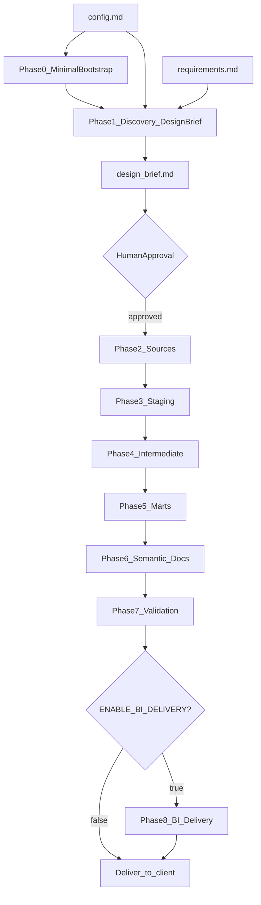
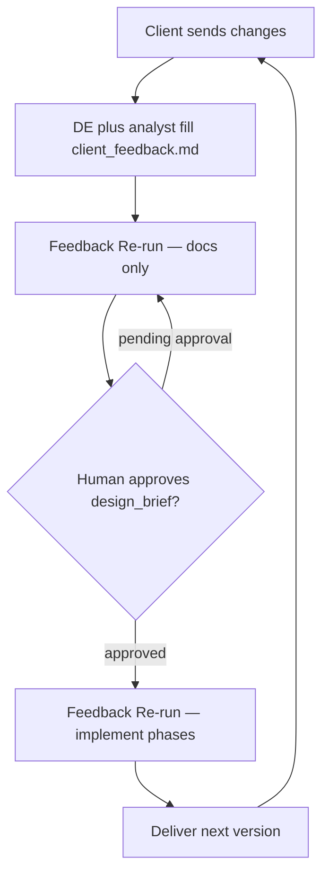

# dbt AI Prompt Library — Client-Driven Analytics Engineering

> **Purpose:** A reusable, domain-agnostic prompt library for building production-ready dbt projects using AI coding agents (Cursor, Claude Code, Copilot, etc.), dbt Agent Skills, and the `dbt-labs/codegen` plugin.
>
> **Single project input:** Attach or reference one freeform requirements document ([`requirements.md`](requirements.md)). The AI extracts domain context, business questions, and schema hints from that document. Nothing else is pre-configured.

---

## How to Use This Library

1. Copy and fill [`requirements.md`](requirements.md) — goals, domain background, business questions, pain points, and any schema or source-system hints.
2. Fill in `[config.md](config.md)` — one file for all project variables (`PROJECT_ROOT`, connection details, `ENABLE_SEMANTIC_LAYER`, etc.).
3. Run **Phase 0 — Minimal Bootstrap** with `config.md` only (skip if `dbt_project.yml`, `profiles.yml`, and `dbt deps` already succeed).
4. Run **Phase 1** with `config.md` and `requirements.md` attached. Phase 1 writes the draft Design Brief to `DESIGN_BRIEF_DOC`.
5. **Edit and approve** [`design_brief.md`](design_brief.md) — correct errors, set `Status: approved`, then continue.
6. Run Phases 2–7 in sequence. Attach `config.md`, `requirements.md`, and `design_brief.md` for each phase. Each build phase reads the approved Design Brief from disk — not hardcoded table lists.
7. When `ENABLE_BI_DELIVERY: true` in config, run **Phase 8** after Phase 7.
8. Deliver to client. When the client sends changes, the **data engineer and analyst** fill [`client_feedback.md`](client_feedback.md), then run **Feedback Re-run Pass 1** (docs only — no Pass 2 phrase), approve `design_brief.md`, then **Feedback Re-run Pass 2** (with explicit confirmation phrase).
9. Log every run in the **AI Execution Log** at the bottom.

> **Initial build:** Phase 0 → Phase 1 → approve `design_brief.md` → Phases 2–6 → Phase 7 → Phase 8 (optional).
>
> **Client feedback:** Client comments → team fills `client_feedback.md` → **Feedback Re-run Pass 1** (agent resets Status, updates docs, stops) → human approves `design_brief.md` → **Feedback Re-run Pass 2** (message includes e.g. `Design brief is approved — continue with Pass 2`) → deliver again.



### Client feedback (post-delivery)




---

## Project Config

All connection and project identity variables live in `[config.md](config.md)`.

Read `config.md` at the start of every phase and substitute values into commands and file paths.

> **v1 scope:** One `SOURCE_NAME` and one `SCHEMA_NAME` per engagement. Requirements may describe multiple upstream systems in prose; live discovery uses `SCHEMA_NAME` from config.

---

## Skill Reference Matrix


| Skill                                 | Used In                              |
| ------------------------------------- | ------------------------------------ |
| `using-dbt-for-analytics-engineering` | Phase 0, 1, 2, 3, 4, 5, 6, 7, Feedback Re-run |
| `running-dbt-commands`                | Phase 0, 1, 2, 3, 6, 7, Feedback Re-run       |
| `building-dbt-semantic-layer`         | Phase 6 (when enabled)                        |


> **Client feedback:** One **Feedback Re-run** prompt after the team fills `client_feedback.md`.

> Install dbt Agent Skills:
>
> ```bash
> npx skills add dbt-labs/dbt-agent-skills/skills/dbt
> ```

---

## Layer Naming Conventions (Fixed)

AI infers `{entity}`, `{source}`, and `{raw_table}` from the requirements doc and discovered schema. The framework enforces these prefixes and responsibilities only.


| Layer          | Pattern                                | Example                                                    | Responsibility                                                                                                    |
| -------------- | -------------------------------------- | ---------------------------------------------------------- | ----------------------------------------------------------------------------------------------------------------- |
| Staging        | `stg_{source}__{raw_table}`            | `stg_{source}__{raw_table}`                                | 1:1 source grain; clean, rename, cast columns only — **no joins**                                                 |
| Intermediate   | `int_{entity}__{relationship_or_verb}` | `int_{fact}__{dim}_enriched`, `int_{left}__{right}_joined` | **All relationship logic**: FK joins, bridge resolution, grain enrichment, orphan handling, pre-mart aggregations |
| Marts (fact)   | `fct_{entity}`                         | `fct_{entity}`                                             | Presentation-ready fact at declared grain                                                                         |
| Marts (dim)    | `dim_{entity}`                         | `dim_{entity}`                                             | Presentation-ready dimension; attributes + optional rollups from intermediate                                     |
| Marts (bridge) | `bridge_{entity}`                      | `bridge_{entity}`                                          | Many-to-many or associative tables for star schema                                                                |


**Layer rules:**

- **Staging** — one model per source table; never join across tables.
- **Intermediate** — every cross-table join, FK validation, and grain enrichment happens here before marts.
- **Marts** — consume intermediate outputs; light presentation logic only (e.g. segmentation CASE). **No new joins that bypass intermediate.**

### Intermediate Model Types


| Type           | Naming pattern                   | Purpose                                   |
| -------------- | -------------------------------- | ----------------------------------------- |
| Join / enrich  | `int_{fact}__{dim}_enriched`     | Attach dimension attributes to fact grain |
| Bridge resolve | `int_{left}__{right}_joined`     | Resolve many-to-many via bridge table     |
| Aggregate prep | `int_{entity}__{metric}_summary` | Roll up measures before mart              |
| Reconcile      | `int_{metric}__reconciled`       | Cross-source or cross-fact alignment      |


### Table Classification Rules (AI applies in Phase 1)


| Classification | Criteria                                                                       |
| -------------- | ------------------------------------------------------------------------------ |
| **Fact**       | Transactional or event grain; contains measures; FKs point to dimensions       |
| **Dimension**  | Descriptive attributes; relatively stable entity grain                         |
| **Bridge**     | Resolves many-to-many between two entities (line items, allocations, mappings) |


---

## Project Structure

Engagement folder (`PROJECT_ROOT`, default `.`):

```text
./
├── config.md
├── requirements.md
├── design_brief.md
├── client_feedback.md                 # filled by DE/analyst after client review
├── AI_EXECUTION_LOG.md                  # optional per-engagement log
├── dbt_project.yml
├── packages.yml
├── profiles.yml
├── models/
│   ├── staging/<SOURCE_NAME>/
│   │   ├── _sources.yml
│   │   ├── _stg_<SOURCE_NAME>__models.yml
│   │   └── stg_<SOURCE_NAME>__{raw_table}.sql
│   ├── intermediate/
│   │   └── int_{entity}__{relationship_or_verb}.sql
│   ├── marts/
│   │   ├── {subject_area}/
│   │   │   ├── fct_{entity}.sql
│   │   │   ├── dim_{entity}.sql
│   │   │   └── bridge_{entity}.sql
│   │   └── _marts__models.yml
│   └── semantic/                    # when ENABLE_SEMANTIC_LAYER: true
│       └── semantic_models.yml
└── README.md
```

> `<PROJECT_NAME>`, `<SOURCE_NAME>`, `PROJECT_ROOT` — substitute from `[config.md](config.md)`.

---

## Design Brief Template (Phase 1 Output → `DESIGN_BRIEF_DOC`)

Phase 1 writes this document to `DESIGN_BRIEF_DOC` from config (default `design_brief.md`). Phases 2–7 must read the **approved** file as the single source of truth. Do not invent tables, relationships, or model names not listed here.

# Design Brief — 

**Status:** pending approval

> PROJECT_NAME from config.md

## 1. Domain Summary


## 2. Business Questions → KPI Map


| Business Question | Proposed KPI / Metric | Target Grain |
| ----------------- | --------------------- | ------------ |
|                   |                       |              |


## 3. Source Inventory


| Raw Table | Row Grain | PK Column(s) | Classification (fact / dim / bridge) |
| --------- | --------- | ------------ | ------------------------------------ |
|           |           |              |                                      |


## 4. Relationship Graph


| From Table | To Table | Join Key | Cardinality | Orphan Count (from dbt show) |
| ---------- | -------- | -------- | ----------- | ---------------------------- |
|            |          |          |             |                              |


## 5. Column Standardization Plan


| Source Table | Source Column | Staging Column | Transformation |
| ------------ | ------------- | -------------- | -------------- |
|              |               |                |                |


## 6. Staging Model List


| Staging Model   | Source Table | Notes |
| --------------- | ------------ | ----- |
| stg_{raw_table} |              |       |


## 7. Relationship Resolution Plan (Intermediate)


| Intermediate Model   | Type                                  | Inputs (staging refs) | Join Keys | Output Grain |
| -------------------- | ------------------------------------- | --------------------- | --------- | ------------ |
| int_{entity}__{verb} | join / bridge / aggregate / reconcile |                       |           |              |


## 8. Mart Star Schema


| Mart Model      | Type   | Primary Intermediate Input(s) | Grain | Subject Area Folder |
| --------------- | ------ | ----------------------------- | ----- | ------------------- |
| fct_{entity}    | fact   |                               |       |                     |
| dim_{entity}    | dim    |                               |       |                     |
| bridge_{entity} | bridge |                               |       |                     |


## 9. Semantic Metrics List


| Metric Name | Type (simple / ratio / derived) | Base Mart Model | Measure / Formula | Filter |
| ----------- | ------------------------------- | --------------- | ----------------- | ------ |
|             |                                 |                 |                   |        |


## 10. Work Batches (max 3 tables per codegen call)


| Batch | Tables | Phase   |
| ----- | ------ | ------- |
| 1     |        | sources |
| 2     |        | sources |
| ...   |        | staging |


### Approval Gate

After Phase 1, the agent must:

1. Write the complete Design Brief to `DESIGN_BRIEF_DOC` with `Status: pending approval` at the top — no `_sources.yml`, staging SQL, or mart models yet.
2. Write as plain Markdown in the file (not chat-only, not wrapped in code fences).
3. Present open questions or ambiguities found during discovery.
4. **Stop and wait** for the human to edit `DESIGN_BRIEF_DOC`, correct errors, set `Status: approved`, then proceed to Phase 2.

**After client feedback (Feedback Re-run Pass 1):** Always set `Status: pending approval` on **DESIGN_BRIEF_DOC first** — even if it still says `approved` from the initial build — then update `REQUIREMENTS_DOC` (business context, no status field) and `DESIGN_BRIEF_DOC` (technical KPI map); stop. Pass 2 requires explicit human confirmation in the message **and** `Status: approved` on **DESIGN_BRIEF_DOC** before any dbt or BI changes. **Implementation always follows the approved Design Brief** — not requirements.md alone.

---

## Phase Prompt Convention

Every phase prompt assumes the agent has read:

1. `[config.md](config.md)` — project variables (`PROJECT_ROOT`, `PROJECT_NAME`, `SCHEMA_NAME`, `SOURCE_NAME`, `ENABLE_SEMANTIC_LAYER`, `ENABLE_BI_DELIVERY`, connection details, etc.)
2. Requirements document — path from `REQUIREMENTS_DOC` in config.md (Phase 1+ only; Phase 0 uses config only)
3. Design Brief file — path from `DESIGN_BRIEF_DOC` (Phases 2–8 and Feedback Re-run; must have `Status: approved` before Phase 2)
4. Client feedback file — path from `CLIENT_FEEDBACK_DOC` (**Feedback Re-run** only; filled by the team before running)

Each phase prompt opens with:

```
Read config.md and substitute all project variables.
```

Phases 1–8, 1b, and 10 also open with:

```
Read the requirements document at REQUIREMENTS_DOC.
```

Phases 2–8 and Feedback Re-run also open with:

```
Read DESIGN_BRIEF_DOC. Verify Status is approved before building.
```

Feedback Re-run also opens with:

```
Read CLIENT_FEEDBACK_DOC. Execute only the phases listed under "Phases to re-run this cycle".
```

**Feedback Re-run — default is Pass 1 (docs).** Run Pass 2 only when the human message explicitly requests implementation (e.g. `Design brief is approved — continue with Pass 2`) and `DESIGN_BRIEF_DOC` shows `Status: approved`. Do not skip Pass 1 because Status is still `approved` from the initial build.

**Feedback Re-run Pass 2 only:**

```
Read DESIGN_BRIEF_DOC. Verify Status is approved before changing dbt SQL, semantic layer, or BI assets.
Implementation follows DESIGN_BRIEF_DOC only (requirements.md is context, not the build spec).
```

---

## PHASE 0 — Minimal Bootstrap

**Skills:** `using-dbt-for-analytics-engineering`, `running-dbt-commands`
**Output:** `dbt_project.yml`, `packages.yml`, `profiles.yml`, empty `models/` folder structure; `dbt deps` succeeds
**Prerequisite:** `[config.md](config.md)` filled in
**Skip when:** Project already has working `dbt_project.yml`, `profiles.yml`, and `dbt deps` / `dbt debug` succeed

```
You are an analytics engineer using the using-dbt-for-analytics-engineering and running-dbt-commands skills.

Read config.md and substitute all project variables. Do not read requirements.md in this phase.

Create minimal dbt project bootstrap only under PROJECT_ROOT (current directory: `.`) — config and empty folders. No sources, no models, no SQL.

If the project directory is completely empty, you may run `dbt init` to create the base folder, then delete `models/example/` and any sample files. Prefer writing files directly when the directory already exists.

Using config.md:

1. dbt_project.yml (at PROJECT_ROOT)
   - Project name: PROJECT_NAME
   - Materializations: staging → view (schema STAGING_SCHEMA), intermediate → view (schema INTERMEDIATE_SCHEMA), marts → table (schema MARTS_SCHEMA)
   - Model paths: models. Target path: target.

2. packages.yml
   - dbt-labs/codegen version 0.14.0
   - dbt-labs/dbt_utils version >=1.0.0 <2.0.0

3. profiles.yml
   - Profile name: PROJECT_NAME
   - Adapter: WAREHOUSE_TYPE (default postgres connection block; include commented blocks for snowflake, redshift, bigquery if not postgres)
   - host: DB_HOST, port: DB_PORT, dbname: DATABASE_NAME, user: DB_USER, password: DB_PASSWORD, threads: DB_THREADS

4. Create empty folder structure (no SQL files):
   - models/staging/SOURCE_NAME/
   - models/intermediate/
   - models/marts/
   - models/semantic/ (even when ENABLE_SEMANTIC_LAYER is false)

5. Run: dbt deps
6. Confirm: dbt debug (or dbt parse) succeeds and warehouse connection is valid.

Do not create _sources.yml or any model SQL. Proceed to Phase 1 after bootstrap succeeds.
```

---

## PHASE 1 — Discovery & Design Brief

**Skills:** `using-dbt-for-analytics-engineering`, `running-dbt-commands`
**Output:** `DESIGN_BRIEF_DOC` with full Design Brief (all 10 sections above) — `Status: pending approval`
**Prerequisite:** `[config.md](config.md)` filled in; requirements document; **Phase 0 bootstrap complete** (`dbt deps` succeeded)

```
You are an analytics engineer using the using-dbt-for-analytics-engineering and running-dbt-commands skills.

Read config.md and substitute all project variables. Read the requirements document at REQUIREMENTS_DOC.

Read the requirements document in full. Extract: domain context, business goals, pain points, business questions, and any named source systems or schemas.

Prerequisite check: confirm dbt_project.yml, profiles.yml, and packages (codegen) are installed. If not, run Phase 0 first.

Using config.md values, discover the live schema:

1. Run codegen for the full source schema:
   dbt run-operation generate_source --args '{
     "schema_name": "<SCHEMA_NAME>",
     "database_name": "<DATABASE_NAME>",
     "generate_columns": true
   }'

2. For every table you will model, follow the 6-step discovery process from the using-dbt-for-analytics-engineering skill (discovering-data reference):
   - Inventory objects
   - Sample raw data with dbt show
   - Confirm grain (what one row represents)
   - Profile nulls and distinct counts on PKs and FKs
   - Validate relationships — check orphan FK counts with dbt show
   - Document findings

3. Classify each table as fact, dimension, or bridge using the classification rules in this prompt library.

4. Infer the relationship graph: PKs, FKs, join keys, cardinality. Quantify orphan counts where FKs exist.

5. Propose column standardization (renames, casts, derived flags) using domain language from the requirements doc — not generic assumptions.

6. Draft the full Design Brief (all 10 sections). Include:
   - relationship_resolution_plan: every intermediate model needed before marts
   - star_schema: every fct_, dim_, and bridge_ mart with grains and subject area folders
   - semantic metrics mapped to business questions from the requirements doc
   - work_batches: group tables in batches of 3 max for codegen calls

7. Draft a KPI traceability matrix (business question → source → staging → intermediate → mart → metric).

8. Write the complete Design Brief to DESIGN_BRIEF_DOC (plain markdown file). Set `Status: pending approval` at the top.

STOP HERE. Do not create _sources.yml, staging SQL, intermediate SQL, or mart models until DESIGN_BRIEF_DOC has `Status: approved`.
```

---

## PHASE 2 — Source Definitions

**Skills:** `running-dbt-commands`, `using-dbt-for-analytics-engineering`
**Output:** `models/staging/<SOURCE_NAME>/_sources.yml` (SOURCE_NAME from config.md)
**Prerequisite:** `DESIGN_BRIEF_DOC` has `Status: approved`; Phase 0 bootstrap complete

```
You are an analytics engineer using the running-dbt-commands and using-dbt-for-analytics-engineering skills.

Read config.md and substitute all project variables. Read the requirements document at REQUIREMENTS_DOC.
Read DESIGN_BRIEF_DOC. Verify Status is approved before building.

Use work_batches for sources and source inventory from DESIGN_BRIEF_DOC.

For each batch in DESIGN_BRIEF_DOC work_batches (sources phase):

1. Run codegen:
   dbt run-operation generate_source --args '{
     "schema_name": "<SCHEMA_NAME>",
     "database_name": "<DATABASE_NAME>",
     "table_names": [<tables from current batch>],
     "generate_columns": true
   }'

2. Build or append source blocks in models/staging/<SOURCE_NAME>/_sources.yml:
   - source name: SOURCE_NAME (from config.md)
   - Business-focused table descriptions tied to domain summary in DESIGN_BRIEF_DOC
   - Column documentation in plain English
   - unique + not_null tests on PKs from relationship graph
   - relationships + not_null tests on FKs from relationship graph
   - accepted_values tests on status/type columns — use values discovered via dbt show, not guessed

Do not invent tables not in DESIGN_BRIEF_DOC source inventory.
After all batches: run dbt compile and confirm _sources.yml parses.
```

---

## PHASE 3 — Staging Models

**Skills:** `running-dbt-commands`, `using-dbt-for-analytics-engineering`
**Output:** `stg_<SOURCE_NAME>__{raw_table}.sql` per DESIGN_BRIEF_DOC; `_stg_<SOURCE_NAME>__models.yml` (SOURCE_NAME from config.md)
**Prerequisite:** Phase 2 complete; `_sources.yml` compiles

```
You are an analytics engineer using the running-dbt-commands and using-dbt-for-analytics-engineering skills.

Read config.md and substitute all project variables. Read the requirements document at REQUIREMENTS_DOC.
Read DESIGN_BRIEF_DOC. Verify Status is approved before building.

Read staging model list and column standardization plan from DESIGN_BRIEF_DOC.

For each staging model in DESIGN_BRIEF_DOC (use work_batches for staging, max 3 tables per batch):

1. Run codegen per table:
   dbt run-operation generate_base_model --args '{
     "source_name": "<SOURCE_NAME>",
     "table_name": "<raw_table>"
   }'

2. Transform into models/staging/<SOURCE_NAME>/stg_<SOURCE_NAME>__<raw_table>.sql:
   - Apply renames, casts, and derived flags from column standardization plan
   - Retain source grain — one row in, one row out
   - Do not implement joins across tables

3. After all staging SQL files exist, generate documentation:
   dbt run-operation generate_model_yaml --args '{
     "model_names": [<all stg model names from DESIGN_BRIEF_DOC>]
   }'

4. Build models/staging/<SOURCE_NAME>/_stg_<SOURCE_NAME>__models.yml:
   - Semantic descriptions tied to domain summary
   - Column documentation for every field
   - unique + not_null on PKs; relationships tests on FKs to other stg_ models
   - accepted_values on status/type columns from discovered values

Run dbt compile, then dbt test --select staging. Fix failures before Phase 4.
```

---

## PHASE 4 — Intermediate Relationship Layer

**Skills:** `using-dbt-for-analytics-engineering`
**Output:** All models in DESIGN_BRIEF_DOC `relationship_resolution_plan`
**Prerequisite:** Phase 3 complete; staging tests pass

```
You are an analytics engineer using the using-dbt-for-analytics-engineering skill.

Read config.md and substitute all project variables. Read the requirements document at REQUIREMENTS_DOC.
Read DESIGN_BRIEF_DOC. Verify Status is approved before building.

Read relationship resolution plan and relationship graph from DESIGN_BRIEF_DOC.

Build every intermediate model listed in DESIGN_BRIEF_DOC. This phase owns ALL cross-table logic.

For each intermediate model:

1. Join / enrich (int_{fact}__{dim}_enriched):
   - Join staging fact to staging dimension on validated FK from relationship graph
   - Expose has_valid_{fk} flag or filter orphans per DESIGN_BRIEF_DOC orphan counts

2. Bridge resolve (int_{left}__{right}_joined):
   - Join bridge table to both parent entities
   - Preserve bridge grain; attach attributes from both sides

3. Aggregate prep (int_{entity}__{metric}_summary):
   - Roll up measures needed by dim or fct marts in DESIGN_BRIEF_DOC star schema
   - Group by entity PK; expose volume, financial, and temporal metrics as needed by KPI map

4. Reconcile (int_{metric}__reconciled):
   - Align measures across related facts when KPI map requires it
   - Document reconciliation logic in model description

Rules:
- Use {{ ref() }} for all staging and intermediate references — never source()
- Never skip to marts with raw staging joins — all cross-table logic lives here
- Validate join results with dbt show; confirm grain matches DESIGN_BRIEF_DOC output grain column
- Run dbt compile after each model; run dbt test --select intermediate when YAML exists

Output all intermediate SQL files listed in DESIGN_BRIEF_DOC.
```

---

## PHASE 5 — Mart Models

**Skills:** `using-dbt-for-analytics-engineering`
**Output:** `fct_{entity}.sql`, `dim_{entity}.sql`, `bridge_{entity}.sql` per DESIGN_BRIEF_DOC star schema
**Prerequisite:** Phase 4 complete

```
You are an analytics engineer using the using-dbt-for-analytics-engineering skill.

Read config.md and substitute all project variables. Read the requirements document at REQUIREMENTS_DOC.
Read DESIGN_BRIEF_DOC. Verify Status is approved before building.

Read mart star schema section from DESIGN_BRIEF_DOC.

Build every mart model listed. Use naming conventions: fct_{entity}, dim_{entity}, bridge_{entity}.

For each mart:

1. fct_{entity}:
   - Consume intermediate enriched fact outputs — not raw staging joins
   - Grain: as declared in DESIGN_BRIEF_DOC star schema
   - Retain FK columns for dimension joins in BI tools
   - Materialization: table

2. dim_{entity}:
   - Base attributes from staging dimension model
   - Behavioral rollups from intermediate aggregate models where DESIGN_BRIEF_DOC specifies
   - Optional segmentation column using CASE logic derived from KPI map and requirements doc — not hardcoded tiers
   - Materialization: table

3. bridge_{entity}:
   - Consume intermediate bridge resolution output
   - Preserve associative grain from DESIGN_BRIEF_DOC
   - Materialization: table

Rules:
- Organize files under subject area folders from DESIGN_BRIEF_DOC star schema
- No new joins that bypass intermediate models
- Use {{ ref() }} only
- Run dbt compile; validate grain with dbt show per mart

Output all mart SQL files.
```

---

## PHASE 6 — Semantic Layer & Documentation

**Skills:** `building-dbt-semantic-layer` (when enabled), `running-dbt-commands`, `using-dbt-for-analytics-engineering`
**Output:** `_marts__models.yml`, project `README.md`, completed KPI traceability matrix; `semantic_models.yml` when `ENABLE_SEMANTIC_LAYER: true`
**Prerequisite:** Phase 5 complete

```
You are an analytics engineer using the building-dbt-semantic-layer, running-dbt-commands, and using-dbt-for-analytics-engineering skills.

Read config.md and substitute all project variables. Read ENABLE_SEMANTIC_LAYER.
Read the requirements document at REQUIREMENTS_DOC.
Read DESIGN_BRIEF_DOC. Verify Status is approved before building.

Read semantic metrics list and KPI map from DESIGN_BRIEF_DOC.

If ENABLE_SEMANTIC_LAYER is true:

1. models/semantic/semantic_models.yml
   - Register all fct_ and dim_ marts from DESIGN_BRIEF_DOC star schema
   - Define every metric from DESIGN_BRIEF_DOC section 9
   - For each metric: type (simple / ratio / derived), measure, filter, label, business glossary description
   - Configure entities, dimensions, measures, grains, and join paths per MetricFlow spec

If ENABLE_SEMANTIC_LAYER is false:
   - Skip models/semantic/semantic_models.yml
   - Note in README and KPI matrix: metrics are BI-defined, no semantic layer

2. models/marts/_marts__models.yml
   - Run codegen:
     dbt run-operation generate_model_yaml --args '{
       "model_names": [<all fct_, dim_, bridge_ model names from DESIGN_BRIEF_DOC>]
     }'
   - Enrich with semantic descriptions and KPI linkage from DESIGN_BRIEF_DOC
   - unique + not_null on PKs; relationships tests on FKs between marts

3. README.md — project runbook:
   - Problem statement from requirements doc domain summary
   - Completed KPI traceability matrix (staging → intermediate → mart → metric)
   - Layer map: staging → intermediate → marts → semantic (or note semantic skipped)
   - Environment setup: dbt deps, profiles.yml, warehouse connection, PROJECT_ROOT
   - Execution commands: dbt run, dbt test, dbt build
   - Agent skills and phase sequence used
   - Codegen macro reference

4. Finalize KPI traceability matrix with actual model names from this project.
   - When ENABLE_SEMANTIC_LAYER is false, use "N/A — BI-defined" in Semantic Metric column

Run dbt compile. When ENABLE_SEMANTIC_LAYER is true, validate semantic layer config parses.
```

---

## PHASE 7 — Final Validation

**Skills:** `running-dbt-commands`, `using-dbt-for-analytics-engineering`
**Output:** Passing `dbt build`, grain checks, updated AI Execution Log
**Prerequisite:** Phase 6 complete

```
You are an analytics engineer using the running-dbt-commands and using-dbt-for-analytics-engineering skills.

Read config.md and substitute all project variables.
Read the requirements document at REQUIREMENTS_DOC.
Read DESIGN_BRIEF_DOC.

1. Run dbt build --select staging+ (or full project if small enough)
2. Fix any compile or test failures, or document blockers in the AI Execution Log
3. Run dbt show on one fct_ mart and one dim_ mart to confirm grain matches DESIGN_BRIEF_DOC
4. When ENABLE_SEMANTIC_LAYER is true, confirm semantic_models.yml compiles
5. Update the AI Execution Log row for Phase 7 with results, hallucinations found, and manual corrections

Do not add new models or change DESIGN_BRIEF_DOC in this phase — validation and fixes only.
```

---

## PHASE 8 — BI Delivery (optional)

**Skills:** `using-dbt-for-analytics-engineering` (read KPI map); BI tool MCP or manual steps per `BI_TOOL`
**Output:** Governed measures and report layout per `BI_BUILD_GUIDE_DOC`; BI model connected to marts schema
**Prerequisite:** Phase 7 `dbt build` pass; `ENABLE_BI_DELIVERY: true` in config

```
You are an analytics engineer delivering a BI layer on top of built dbt marts.

Read config.md and substitute all project variables. Read ENABLE_BI_DELIVERY and BI_TOOL.
If ENABLE_BI_DELIVERY is false, skip this phase entirely.

Read the requirements document at REQUIREMENTS_DOC.
Read DESIGN_BRIEF_DOC — §2 KPI map and §9 semantic metrics.
Read BI_BUILD_GUIDE_DOC if it exists; create it if missing and BI delivery is in scope.

1. Connect BI semantic model to MARTS_SCHEMA tables (fct_*, dim_*, bridge_* from Design Brief §8).

2. Create governed measures for every KPI in Design Brief §9:
   - One measure per KPI; do not use raw column aggregations on fact tables in report visuals
   - Measure logic must match semantic_models.yml filters when ENABLE_SEMANTIC_LAYER is true
   - When semantic layer is disabled, measures must match Design Brief §9 formulas and mart column names

3. Write or update BI_BUILD_GUIDE_DOC:
   - Page / dashboard map to business questions from requirements.md
   - Which measure goes on which visual type (card vs breakdown chart)
   - Required dimension relationships for slicers (activate inactive relationships if noted)
   - Explicit rule: executive pages = totals + time trends; detail pages = dimensional breakdowns

4. Validate each measure returns a non-blank value in a total card context where data exists.
   - Use DIVIDE(..., 0) or IF(denominator=0, 0, ...) for ratio measures — never leave BLANK when client expects zero

5. Update AI_EXECUTION_LOG with Phase 8 row.

Do not change dbt models in this phase unless a compile error proves mart schema mismatch — document blockers instead.
```

---

## Client feedback

After delivery, the **client** sends corrections. The **data engineer and analyst** document them in `CLIENT_FEEDBACK_DOC` — no separate agent phase for intake.

### Team workflow (manual)

1. Client says what is wrong or how a metric should be defined.
2. Fill [`client_feedback.md`](client_feedback.md): **What the client said** → **Agreed fix** → **Phases** (use the phase guide in that file).
3. Write the union of phase numbers under **Phases to re-run this cycle**.
4. Run **Feedback Re-run** with `config.md`, `requirements.md`, `design_brief.md`, and `client_feedback.md` attached — **no Pass 2 phrase in the message**. Agent runs Pass 1: sets `design_brief.md` to `Status: pending approval` **first** (even if it still says `approved` from the initial build), updates both docs per client feedback, then **stops**.
5. **Review** `requirements.md` and `design_brief.md`; correct errors; set `Status: approved` on **design_brief.md** only.
6. **Re-run Feedback Re-run** with an explicit Pass 2 phrase in the message (e.g. `Design brief is approved — continue with Pass 2`). Re-attach this prompt with that confirmation.
7. Agent runs Pass 2: implements listed phases 3–8 from the **approved design brief**; skips re-discovery unless new tables are named.
8. Deliver again. Repeat from step 1 if the client sends more changes.

### Phase guide (for the Phases column)

| Phase | Re-run when |
| ----- | ----------- |
| **1** | KPI definition or grain changed → update `requirements.md` (business) and `design_brief.md` §2 and §9 (technical); **approve design_brief.md** before code |
| **3** | Staging filters or status flags changed |
| **4** | Joins, reconciliation, or intermediate logic changed |
| **5** | Mart columns or grain changed |
| **6** | Semantic layer metrics changed (`ENABLE_SEMANTIC_LAYER: true`) |
| **7** | Run `dbt build` + tests — include whenever 3–6 ran |
| **8** | BI measures or report changed (`ENABLE_BI_DELIVERY: true`) |

Pick the **minimum** phases. Do not restart Phase 0. Re-run Phase 2 only if new source tables are required.

---

## FEEDBACK RE-RUN — After client review

**Skills:** `using-dbt-for-analytics-engineering`, `running-dbt-commands` (+ BI tool if Phase 8 listed)
**Prerequisite:** `CLIENT_FEEDBACK_DOC` filled by the team; **Phases to re-run this cycle** is set
**Output:** Updated docs (pass 1) or updated code + passing `dbt build` (pass 2); updated execution log

> **Two passes per feedback cycle** — attach the same prompt both times:
>
> | Pass | When it runs | What the agent does |
> | ---- | ------------ | ------------------- |
> | **Pass 1 (docs)** | **Default** — every time you run Feedback Re-run **unless** your message explicitly requests Pass 2 | Set `DESIGN_BRIEF_DOC` to `Status: pending approval` **first**, update `REQUIREMENTS_DOC` + `DESIGN_BRIEF_DOC` per `CLIENT_FEEDBACK_DOC`, **stop** |
> | **Pass 2 (implement)** | Only when your message says e.g. `Design brief is approved — continue with Pass 2` **and** `DESIGN_BRIEF_DOC` shows `Status: approved` | Run listed phases 3–8 from the approved Design Brief; no doc rewrites |
>
> **Important:** `DESIGN_BRIEF_DOC` may still show `approved` from the initial build. That does **not** mean Pass 1 is done for this feedback cycle. On the first Feedback Re-run after client review, the agent **always** runs Pass 1 unless you explicitly ask for Pass 2 in the same message.

```
You are an analytics engineer implementing client feedback from a completed delivery.

Read config.md and substitute all project variables.
Read CLIENT_FEEDBACK_DOC — every row in Changes, and the "Phases to re-run this cycle" list.
Read REQUIREMENTS_DOC and DESIGN_BRIEF_DOC.

## Step 0 — Which pass? (read the human message first)

`REQUIREMENTS_DOC` has no status field — update it on Pass 1 for business context only. **All dbt and BI implementation follows DESIGN_BRIEF_DOC.**

**Run Pass 2** only when **both** are true:
1. The human message explicitly requests implementation (e.g. `Design brief is approved — continue with Pass 2`, `approved — continue`, `continue with Pass 2`)
2. `DESIGN_BRIEF_DOC` shows `**Status:** approved`

**Otherwise run Pass 1** — including when:
- This is the first Feedback Re-run after the team filled `CLIENT_FEEDBACK_DOC`
- `DESIGN_BRIEF_DOC` still shows `**Status:** approved` from the initial delivery (reset it in Pass 1 step 1)
- The human attached this prompt without an explicit Pass 2 confirmation phrase

Do **not** skip Pass 1 because Status is already `approved`. Do **not** ask the human to confirm before running Pass 1. Do **not** change dbt SQL, semantic layer, or BI assets on Pass 1.

---

### Pass 1 — Documentation only (default)

Do **not** modify dbt models, tests, semantic_models.yml, or BI assets. Do **not** run dbt build.

1. **First action — reset approval gate:** Set the top line of `DESIGN_BRIEF_DOC` to:
   `**Status:** pending approval`
   Do this **before** editing any other content — even if the file already says `approved` from the initial build or a prior cycle.

2. Apply **every** change row in `CLIENT_FEEDBACK_DOC` to documentation only:
   - **REQUIREMENTS_DOC:** business questions, constraints, and notes when definitions changed (no `Status` line on this file)
   - **DESIGN_BRIEF_DOC:** §2 and §9 (and §5–§8 when staging, intermediate, mart, or semantic definitions changed)

3. Present a concise summary: what changed per KPI row in each doc, open confirmations flagged in `CLIENT_FEEDBACK_DOC`, and which implementation phases will run after approval (from "Phases to re-run this cycle").

4. **STOP.** Tell the human exactly:
   - Review `REQUIREMENTS_DOC` and `DESIGN_BRIEF_DOC` (`DESIGN_BRIEF_DOC` must still show `Status: pending approval`)
   - Correct any errors in place
   - Set `**Status:** approved` on `DESIGN_BRIEF_DOC`
   - **Re-run this Feedback Re-run prompt** with an explicit confirmation in the message, e.g. `Design brief is approved — continue with Pass 2`

---

### Pass 2 — Implement (human confirmed + Status approved)

Do **not** modify `REQUIREMENTS_DOC` or `DESIGN_BRIEF_DOC` except to fix errors found during build. Do **not** reset Status to `pending approval`.

Verify every `CLIENT_FEEDBACK_DOC` change row is reflected in the approved Design Brief. If docs are out of sync with agreed fixes, run Pass 1 instead (reset Status, update docs, stop) — do not change code.

1. Phase 1 (documentation) is already complete — do not re-run full schema discovery unless `CLIENT_FEEDBACK_DOC` names **new source tables** not in `DESIGN_BRIEF_DOC` §3.

2. Execute only the phases listed under "Phases to re-run this cycle" **except Phase 1**, in ascending order. Build strictly from `DESIGN_BRIEF_DOC` (Phases 3–8 per library prompts).

3. When Phase 7 is listed: run `dbt build` for the affected subgraph (prefer `--select` on changed models).

4. When Phase 8 is listed and `ENABLE_BI_DELIVERY` is true: update BI measures and report per agreed fixes in `DESIGN_BRIEF_DOC` §9.

5. Log results in `AI_EXECUTION_LOG` (feedback cycle summary, models touched, validation queries).

If client feedback is ambiguous, stop and ask the team to clarify `CLIENT_FEEDBACK_DOC` before changing docs or code.
```

---

## KPI Traceability Matrix Template

Populate during Phase 1 (draft in DESIGN_BRIEF_DOC) and finalize in Phase 6 (or Phase 7 when semantic layer disabled).


| Business Question | Source Tables | Staging Models | Intermediate Model | Mart Model | Semantic Metric |
| ----------------- | ------------- | -------------- | ------------------ | ---------- | --------------- |
|                   |               |                |                    |            |                 |


---

## AI Execution Log

Track every phase run. Documenting AI reliability is part of the deliverable.


| Phase | Skill(s) Used                                 | Output                                                | Hallucinations Found | Manual Corrections |
| ----- | --------------------------------------------- | ----------------------------------------------------- | -------------------- | ------------------ |
| 0     | analytics-eng + run-commands                  | Minimal bootstrap (config + empty folders + dbt deps) |                      |                    |
| 1     | analytics-eng + run-commands                  | DESIGN_BRIEF_DOC (pending approval)                   |                      |                    |
| 2     | run-commands + analytics-eng                  | _sources.yml                                          |                      |                    |
| 3     | run-commands + analytics-eng                  | staging SQL + _stg_models.yml                         |                      |                    |
| 4     | analytics-eng                                 | intermediate SQL (relationship layer)                 |                      |                    |
| 5     | analytics-eng                                 | fct_ / dim_ / bridge_ marts                           |                      |                    |
| 6     | semantic-layer + run-commands + analytics-eng | semantic_models.yml (if enabled), _marts__models.yml, README.md |          |                    |
| 7     | run-commands + analytics-eng                  | dbt build pass, grain validation, execution log       |                      |                    |
| 8     | analytics-eng + BI tool                       | BI measures + BI_BUILD_GUIDE_DOC (if ENABLE_BI_DELIVERY) |                   |                    |
| F1    | analytics-eng                                 | Feedback Re-run pass 1 — docs pending approval        |                      |                    |
| F2    | analytics-eng + run-commands                  | Feedback Re-run pass 2 — implement per `client_feedback.md` |              |                    |


---

## Quick Reference: Codegen Macros


| Task                              | Macro                 | Used In                              |
| --------------------------------- | --------------------- | ------------------------------------ |
| Scaffold source YAML from live DB | `generate_source`     | Phase 1 (discovery), Phase 2 (build) |
| Scaffold staging SQL from source  | `generate_base_model` | Phase 3                              |
| Scaffold model YAML documentation | `generate_model_yaml` | Phase 3, Phase 6                     |


```bash
# Substitute SCHEMA_NAME, DATABASE_NAME, SOURCE_NAME from config.md

# Full schema discovery (Phase 1)
dbt run-operation generate_source --args '{
  "schema_name": "<SCHEMA_NAME>",
  "database_name": "<DATABASE_NAME>",
  "generate_columns": true
}'

# Batch source generation (Phase 2)
dbt run-operation generate_source --args '{
  "schema_name": "<SCHEMA_NAME>",
  "database_name": "<DATABASE_NAME>",
  "table_names": ["table_a", "table_b", "table_c"],
  "generate_columns": true
}'

# Staging base model (Phase 3)
dbt run-operation generate_base_model --args '{
  "source_name": "<SOURCE_NAME>",
  "table_name": "table_a"
}'

# Model YAML docs (Phase 3, Phase 6)
dbt run-operation generate_model_yaml --args '{
  "model_names": ["model_a", "model_b"]
}'
```

---

## Tips for AI-Assisted Workflows

**Prompting**

- Always declare the skill at the top: `You are an analytics engineer using the <skill> skill.`
- Separate codegen (run command, capture output) from build (use output to write files). Agents do better when these are explicit.
- Batch codegen calls at 3 tables max to limit context drift.
- Phases 2–7 must read `DESIGN_BRIEF_DOC` with `Status: approved` — never re-infer tables or relationships mid-build.
- Read `[config.md](config.md)` at the start of every phase — do not hardcode connection values in prompts.

**Validation**

- Run `dbt compile` after every phase.
- Run `dbt test --select staging` after Phase 3 before building intermediate models.
- Run `dbt show` to verify grain and join cardinality after Phase 4 and Phase 5.
- Run `dbt build --select staging+` in Phase 7 as the final integration check.
- Never trust boolean flags or accepted_values the AI derives — verify against live data.

**Common Hallucinations to Watch For**

- Wrong join keys (plausible column names that do not exist or are not FKs)
- Invented column names not in source schema
- Incorrect accepted_values lists (guessed status codes)
- Skipping intermediate and joining staging directly in marts
- MetricFlow join path or grain errors
- Financial formulas not supported by requirements doc or discovered data

**When to Override AI**

- Any financial calculation — verify formula against requirements document
- FK relationships — confirm keys and orphan rates in the warehouse before accepting
- Semantic layer grain — review against actual BI query patterns
- Design Brief classification — correct fact / dim / bridge labels in DESIGN_BRIEF_DOC before Phase 2
- Client feedback — team fills `client_feedback.md` first; run **Feedback Re-run** twice (docs → approve → implement)

**Client feedback**

- No separate intake agent phase — DE/analyst own `client_feedback.md`
- List the minimum phases to re-run; do not rebuild 0–7 unless necessary
- **Pass 1 is the default** on Feedback Re-run — agent resets `Status: pending approval` on **design_brief.md first** (even if still `approved` from initial build), updates docs, stops
- **Pass 2** only when the human message explicitly says e.g. `Design brief is approved — continue with Pass 2` and **design_brief.md** shows `Status: approved`

---

## Future Extension: Warehouse MCP Discovery

This library uses **dbt codegen** for schema discovery. When Postgres or Redshift MCP servers are available, an optional Phase 1 supplement can list schemas, tables, and columns via MCP before running `generate_source` — **after Phase 0 bootstrap**. MCP replaces manual schema inspection only, not the approval gate or naming conventions.

MCP is **optional**. Client feedback uses `client_feedback.md` plus **Feedback Re-run** — no automated audit required.

```text
Initial build:
  Phase 0 → 1 → approve design_brief → 2–7 → 8 (optional) → deliver

Client feedback:
  client comments → team fills client_feedback.md → Feedback Re-run Pass 1 (reset Status, update docs, stop) → human approves design_brief → Feedback Re-run Pass 2 (explicit phrase in message) → deliver
```

Do not use MCP and codegen in conflicting ways — MCP informs the relationship graph; codegen scaffolds YAML and SQL.