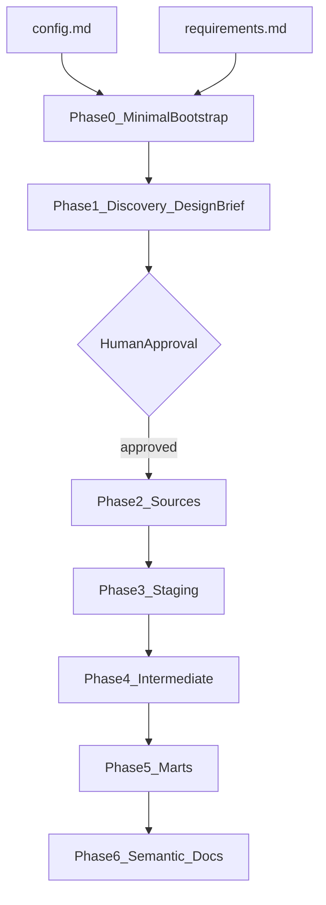

# dbt AI Prompt Library — Client-Driven Analytics Engineering

> **Purpose:** A reusable, domain-agnostic prompt library for building production-ready dbt projects using AI coding agents (Cursor, Claude Code, Copilot, etc.), dbt Agent Skills, and the `dbt-labs/codegen` plugin.
>
> **Single project input:** Attach or reference one freeform requirements document ([`requirements.md`](requirements.md)). The AI extracts domain context, business questions, and schema hints from that document. Nothing else is pre-configured.

---

## How to Use This Library

1. Copy and fill [`requirements.md`](requirements.md) — goals, domain background, business questions, pain points, and any schema or source-system hints.
2. Fill in `[config.md](config.md)` — one file for all project variables.
3. Run **Phase 0 — Minimal Bootstrap** if no working dbt project exists yet (required before codegen discovery). Skip if `dbt_project.yml`, `profiles.yml`, and `dbt deps` already succeed.
4. Run **Phase 1** with `config.md` and the requirements doc attached. Review the **Design Brief** output.
5. **Stop and approve** the Design Brief before continuing. Edit it if needed.
6. Run Phases 2–6 in sequence. Attach `config.md` + requirements doc for each phase. Each phase references the approved Design Brief — not hardcoded table lists.
7. Log every run in the **AI Execution Log** at the bottom.

> **Run order:** Phase 0 (bootstrap) → Phase 1 (discovery) → approve Design Brief → Phases 2–6 (build).




---

## Project Config

All connection and project identity variables live in `[config.md](config.md)`.

Read `config.md` at the start of every phase and substitute values into commands and file paths.

---

## Skill Reference Matrix


| Skill                                 | Used In                   |
| ------------------------------------- | ------------------------- |
| `using-dbt-for-analytics-engineering` | Phase 0, 1, 2, 3, 4, 5, 6 |
| `running-dbt-commands`                | Phase 0, 1, 2, 3, 6       |
| `building-dbt-semantic-layer`         | Phase 6                   |


> **Run order:** Phase 0 (bootstrap) → Phase 1 (discovery) → approve Design Brief → Phases 2–6 (build).

> Install dbt Agent Skills:
>
> ```bash
> npx skills add dbt-labs/dbt-agent-skills/skills/dbt
> ```

---

## Layer Naming Conventions (Fixed)

AI infers `{entity}`, `{source}`, and `{raw_table}` from the requirements doc and discovered schema. The framework enforces these prefixes and responsibilities only.


| Layer          | Pattern                                | Example                                                    | Responsibility                                                                                                    |
| -------------- | -------------------------------------- | ---------------------------------------------------------- | ----------------------------------------------------------------------------------------------------------------- |
| Staging        | `stg_{source}__{raw_table}`            | `stg_{source}__{raw_table}`                                | 1:1 source grain; clean, rename, cast columns only — **no joins**                                                 |
| Intermediate   | `int_{entity}__{relationship_or_verb}` | `int_{fact}__{dim}_enriched`, `int_{left}__{right}_joined` | **All relationship logic**: FK joins, bridge resolution, grain enrichment, orphan handling, pre-mart aggregations |
| Marts (fact)   | `fct_{entity}`                         | `fct_{entity}`                                             | Presentation-ready fact at declared grain                                                                         |
| Marts (dim)    | `dim_{entity}`                         | `dim_{entity}`                                             | Presentation-ready dimension; attributes + optional rollups from intermediate                                     |
| Marts (bridge) | `bridge_{entity}`                      | `bridge_{entity}`                                          | Many-to-many or associative tables for star schema                                                                |


**Layer rules:**

- **Staging** — one model per source table; never join across tables.
- **Intermediate** — every cross-table join, FK validation, and grain enrichment happens here before marts.
- **Marts** — consume intermediate outputs; light presentation logic only (e.g. segmentation CASE). **No new joins that bypass intermediate.**

### Intermediate Model Types


| Type           | Naming pattern                   | Purpose                                   |
| -------------- | -------------------------------- | ----------------------------------------- |
| Join / enrich  | `int_{fact}__{dim}_enriched`     | Attach dimension attributes to fact grain |
| Bridge resolve | `int_{left}__{right}_joined`     | Resolve many-to-many via bridge table     |
| Aggregate prep | `int_{entity}__{metric}_summary` | Roll up measures before mart              |
| Reconcile      | `int_{metric}__reconciled`       | Cross-source or cross-fact alignment      |


### Table Classification Rules (AI applies in Phase 1)


| Classification | Criteria                                                                       |
| -------------- | ------------------------------------------------------------------------------ |
| **Fact**       | Transactional or event grain; contains measures; FKs point to dimensions       |
| **Dimension**  | Descriptive attributes; relatively stable entity grain                         |
| **Bridge**     | Resolves many-to-many between two entities (line items, allocations, mappings) |


---

## Project Structure

```text
<PROJECT_NAME>/
├── dbt_project.yml
├── packages.yml
├── profiles.yml
├── models/
│   ├── staging/<SOURCE_NAME>/
│   │   ├── _sources.yml
│   │   ├── _stg_<SOURCE_NAME>__models.yml
│   │   └── stg_<SOURCE_NAME>__{raw_table}.sql
│   ├── intermediate/
│   │   └── int_{entity}__{relationship_or_verb}.sql
│   ├── marts/
│   │   ├── {subject_area}/
│   │   │   ├── fct_{entity}.sql
│   │   │   ├── dim_{entity}.sql
│   │   │   └── bridge_{entity}.sql
│   │   └── _marts__models.yml
│   └── semantic/
│       └── semantic_models.yml
└── README.md
```

> `<PROJECT_NAME>` and `<SOURCE_NAME>` — substitute from `[config.md](config.md)`.

---

## Design Brief Template (Phase 1 Output)

Phase 1 produces this document. Phases 2–6 must use the **approved** Design Brief as the single source of truth. Do not invent tables, relationships, or model names not listed here.

# Design Brief — 

>  from config.md

## 1. Domain Summary


## 2. Business Questions → KPI Map


| Business Question | Proposed KPI / Metric | Target Grain |
| ----------------- | --------------------- | ------------ |
|                   |                       |              |


## 3. Source Inventory


| Raw Table | Row Grain | PK Column(s) | Classification (fact / dim / bridge) |
| --------- | --------- | ------------ | ------------------------------------ |
|           |           |              |                                      |


## 4. Relationship Graph


| From Table | To Table | Join Key | Cardinality | Orphan Count (from dbt show) |
| ---------- | -------- | -------- | ----------- | ---------------------------- |
|            |          |          |             |                              |


## 5. Column Standardization Plan


| Source Table | Source Column | Staging Column | Transformation |
| ------------ | ------------- | -------------- | -------------- |
|              |               |                |                |


## 6. Staging Model List


| Staging Model   | Source Table | Notes |
| --------------- | ------------ | ----- |
| stg_{raw_table} |              |       |


## 7. Relationship Resolution Plan (Intermediate)


| Intermediate Model   | Type                                  | Inputs (staging refs) | Join Keys | Output Grain |
| -------------------- | ------------------------------------- | --------------------- | --------- | ------------ |
| int_{entity}__{verb} | join / bridge / aggregate / reconcile |                       |           |              |


## 8. Mart Star Schema


| Mart Model      | Type   | Primary Intermediate Input(s) | Grain | Subject Area Folder |
| --------------- | ------ | ----------------------------- | ----- | ------------------- |
| fct_{entity}    | fact   |                               |       |                     |
| dim_{entity}    | dim    |                               |       |                     |
| bridge_{entity} | bridge |                               |       |                     |


## 9. Semantic Metrics List


| Metric Name | Type (simple / ratio / derived) | Base Mart Model | Measure / Formula | Filter |
| ----------- | ------------------------------- | --------------- | ----------------- | ------ |
|             |                                 |                 |                   |        |


## 10. Work Batches (max 3 tables per codegen call)


| Batch | Tables | Phase   |
| ----- | ------ | ------- |
| 1     |        | sources |
| 2     |        | sources |
| ...   |        | staging |


### Approval Gate

After Phase 1, the agent must:

1. Output the complete Design Brief only — no `_sources.yml`, staging SQL, or mart models yet.
2. Output the Design Brief as plain Markdown (do not wrap it in code fences).
3. Present open questions or ambiguities found during discovery.
4. **Stop and wait** for explicit human approval or edits before Phase 2.

---

## Phase Prompt Convention

Every phase prompt assumes the agent has read:

1. `[config.md](config.md)` — project variables (`PROJECT_NAME`, `SCHEMA_NAME`, `SOURCE_NAME`, connection details, etc.)
2. Requirements document — path from `REQUIREMENTS_DOC` in config.md
3. Approved Design Brief (Phases 2–6 only)

Each phase prompt opens with:

```
Read config.md and substitute all project variables. Read the requirements document at REQUIREMENTS_DOC.
```

---

## PHASE 0 — Minimal Bootstrap

**Skills:** `using-dbt-for-analytics-engineering`, `running-dbt-commands`
**Output:** `dbt_project.yml`, `packages.yml`, `profiles.yml`, empty `models/` folder structure; `dbt deps` succeeds
**Prerequisite:** `[config.md](config.md)` filled in
**Skip when:** Project already has working `dbt_project.yml`, `profiles.yml`, and `dbt deps` / `dbt debug` succeed

```
You are an analytics engineer using the using-dbt-for-analytics-engineering and running-dbt-commands skills.

Read config.md and substitute all project variables. Read the requirements document at REQUIREMENTS_DOC.

Create minimal dbt project bootstrap only — config and empty folders. No sources, no models, no SQL.

If the project directory is completely empty, you may run `dbt init` to create the base folder, then delete `models/example/` and any sample files. Prefer writing files directly when the directory already exists.

Using config.md:

1. dbt_project.yml
   - Project name: PROJECT_NAME
   - Materializations: staging → view (schema STAGING_SCHEMA), intermediate → view (schema INTERMEDIATE_SCHEMA), marts → table (schema MARTS_SCHEMA)
   - Model paths: models. Target path: target.

2. packages.yml
   - dbt-labs/codegen version 0.14.0
   - dbt-labs/dbt_utils version >=1.0.0 <2.0.0

3. profiles.yml
   - Profile name: PROJECT_NAME
   - Adapter: WAREHOUSE_TYPE (default postgres connection block; include commented blocks for snowflake, redshift, bigquery if not postgres)
   - host: DB_HOST, port: DB_PORT, dbname: DATABASE_NAME, user: DB_USER, password: DB_PASSWORD, threads: DB_THREADS

4. Create empty folder structure (no SQL files):
   - models/staging/SOURCE_NAME/
   - models/intermediate/
   - models/marts/
   - models/semantic/

5. Run: dbt deps
6. Confirm: dbt debug (or dbt parse) succeeds and warehouse connection is valid.

Do not create _sources.yml or any model SQL. Proceed to Phase 1 after bootstrap succeeds.
```

---

## PHASE 1 — Discovery & Design Brief

**Skills:** `using-dbt-for-analytics-engineering`, `running-dbt-commands`
**Output:** Design Brief (all 10 sections above) — pending human approval
**Prerequisite:** `[config.md](config.md)` filled in; requirements document; **Phase 0 bootstrap complete** (`dbt deps` succeeded)

```
You are an analytics engineer using the using-dbt-for-analytics-engineering and running-dbt-commands skills.

Read config.md and substitute all project variables. Read the requirements document at REQUIREMENTS_DOC.

Read the requirements document in full. Extract: domain context, business goals, pain points, business questions, and any named source systems or schemas.

Prerequisite check: confirm dbt_project.yml, profiles.yml, and packages (codegen) are installed. If not, run Phase 0 first.

Using config.md values, discover the live schema:

1. Run codegen for the full source schema:
   dbt run-operation generate_source --args '{
     "schema_name": "<SCHEMA_NAME>",
     "database_name": "<DATABASE_NAME>",
     "generate_columns": true
   }'

2. For every table you will model, follow the 6-step discovery process from the using-dbt-for-analytics-engineering skill (discovering-data reference):
   - Inventory objects
   - Sample raw data with dbt show
   - Confirm grain (what one row represents)
   - Profile nulls and distinct counts on PKs and FKs
   - Validate relationships — check orphan FK counts with dbt show
   - Document findings

3. Classify each table as fact, dimension, or bridge using the classification rules in this prompt library.

4. Infer the relationship graph: PKs, FKs, join keys, cardinality. Quantify orphan counts where FKs exist.

5. Propose column standardization (renames, casts, derived flags) using domain language from the requirements doc — not generic assumptions.

6. Draft the full Design Brief (all 10 sections). Include:
   - relationship_resolution_plan: every intermediate model needed before marts
   - star_schema: every fct_, dim_, and bridge_ mart with grains and subject area folders
   - semantic metrics mapped to business questions from the requirements doc
   - work_batches: group tables in batches of 3 max for codegen calls

7. Draft a KPI traceability matrix (business question → source → staging → intermediate → mart → metric).

STOP HERE. Output the Design Brief and open questions only.
Do not create _sources.yml, staging SQL, intermediate SQL, or mart models until the Design Brief is approved.
```

---

## PHASE 2 — Source Definitions

**Skills:** `running-dbt-commands`, `using-dbt-for-analytics-engineering`
**Output:** `models/staging/<SOURCE_NAME>/_sources.yml` (SOURCE_NAME from config.md)
**Prerequisite:** Approved Design Brief; Phase 0 bootstrap complete

```
You are an analytics engineer using the running-dbt-commands and using-dbt-for-analytics-engineering skills.

Read config.md and substitute all project variables. Read the requirements document at REQUIREMENTS_DOC.

Read the approved Design Brief. Use work_batches for sources and source inventory for table list.

For each batch in the Design Brief work_batches (sources phase):

1. Run codegen:
   dbt run-operation generate_source --args '{
     "schema_name": "<SCHEMA_NAME>",
     "database_name": "<DATABASE_NAME>",
     "table_names": [<tables from current batch>],
     "generate_columns": true
   }'

2. Build or append source blocks in models/staging/<SOURCE_NAME>/_sources.yml:
   - source name: SOURCE_NAME (from config.md)
   - Business-focused table descriptions tied to domain summary in Design Brief
   - Column documentation in plain English
   - unique + not_null tests on PKs from relationship graph
   - relationships + not_null tests on FKs from relationship graph
   - accepted_values tests on status/type columns — use values discovered via dbt show, not guessed

Do not invent tables not in the Design Brief source inventory.
After all batches: run dbt compile and confirm _sources.yml parses.
```

---

## PHASE 3 — Staging Models

**Skills:** `running-dbt-commands`, `using-dbt-for-analytics-engineering`
**Output:** `stg_<SOURCE_NAME>__{raw_table}.sql` per Design Brief; `_stg_<SOURCE_NAME>__models.yml` (SOURCE_NAME from config.md)
**Prerequisite:** Phase 2 complete; `_sources.yml` compiles

```
You are an analytics engineer using the running-dbt-commands and using-dbt-for-analytics-engineering skills.

Read config.md and substitute all project variables. Read the requirements document at REQUIREMENTS_DOC.

Read the approved Design Brief staging model list and column standardization plan.

For each staging model in the Design Brief (use work_batches for staging, max 3 tables per batch):

1. Run codegen per table:
   dbt run-operation generate_base_model --args '{
     "source_name": "<SOURCE_NAME>",
     "table_name": "<raw_table>"
   }'

2. Transform into models/staging/<SOURCE_NAME>/stg_<SOURCE_NAME>__<raw_table>.sql:
   - Apply renames, casts, and derived flags from column standardization plan
   - Retain source grain — one row in, one row out
   - Do not implement joins across tables

3. After all staging SQL files exist, generate documentation:
   dbt run-operation generate_model_yaml --args '{
     "model_names": [<all stg model names from Design Brief>]
   }'

4. Build models/staging/<SOURCE_NAME>/_stg_<SOURCE_NAME>__models.yml:
   - Semantic descriptions tied to domain summary
   - Column documentation for every field
   - unique + not_null on PKs; relationships tests on FKs to other stg_ models
   - accepted_values on status/type columns from discovered values

Run dbt compile, then dbt test --select staging. Fix failures before Phase 4.
```

---

## PHASE 4 — Intermediate Relationship Layer

**Skills:** `using-dbt-for-analytics-engineering`
**Output:** All models in Design Brief `relationship_resolution_plan`
**Prerequisite:** Phase 3 complete; staging tests pass

```
You are an analytics engineer using the using-dbt-for-analytics-engineering skill.

Read config.md and substitute all project variables. Read the requirements document at REQUIREMENTS_DOC.

Read the approved Design Brief relationship resolution plan and relationship graph.

Build every intermediate model listed in the Design Brief. This phase owns ALL cross-table logic.

For each intermediate model:

1. Join / enrich (int_{fact}__{dim}_enriched):
   - Join staging fact to staging dimension on validated FK from relationship graph
   - Expose has_valid_{fk} flag or filter orphans per Design Brief orphan counts

2. Bridge resolve (int_{left}__{right}_joined):
   - Join bridge table to both parent entities
   - Preserve bridge grain; attach attributes from both sides

3. Aggregate prep (int_{entity}__{metric}_summary):
   - Roll up measures needed by dim or fct marts in Design Brief star schema
   - Group by entity PK; expose volume, financial, and temporal metrics as needed by KPI map

4. Reconcile (int_{metric}__reconciled):
   - Align measures across related facts when KPI map requires it
   - Document reconciliation logic in model description

Rules:
- Use {{ ref() }} for all staging and intermediate references — never source()
- Never skip to marts with raw staging joins — all cross-table logic lives here
- Validate join results with dbt show; confirm grain matches Design Brief output grain column
- Run dbt compile after each model; run dbt test --select intermediate when YAML exists

Output all intermediate SQL files listed in the Design Brief.
```

---

## PHASE 5 — Mart Models

**Skills:** `using-dbt-for-analytics-engineering`
**Output:** `fct_{entity}.sql`, `dim_{entity}.sql`, `bridge_{entity}.sql` per Design Brief star schema
**Prerequisite:** Phase 4 complete

```
You are an analytics engineer using the using-dbt-for-analytics-engineering skill.

Read config.md and substitute all project variables. Read the requirements document at REQUIREMENTS_DOC.

Read the approved Design Brief mart star schema section.

Build every mart model listed. Use naming conventions: fct_{entity}, dim_{entity}, bridge_{entity}.

For each mart:

1. fct_{entity}:
   - Consume intermediate enriched fact outputs — not raw staging joins
   - Grain: as declared in Design Brief star schema
   - Retain FK columns for dimension joins in BI tools
   - Materialization: table

2. dim_{entity}:
   - Base attributes from staging dimension model
   - Behavioral rollups from intermediate aggregate models where Design Brief specifies
   - Optional segmentation column using CASE logic derived from KPI map and requirements doc — not hardcoded tiers
   - Materialization: table

3. bridge_{entity}:
   - Consume intermediate bridge resolution output
   - Preserve associative grain from Design Brief
   - Materialization: table

Rules:
- Organize files under subject area folders from Design Brief star schema
- No new joins that bypass intermediate models
- Use {{ ref() }} only
- Run dbt compile; validate grain with dbt show per mart

Output all mart SQL files.
```

---

## PHASE 6 — Semantic Layer & Documentation

**Skills:** `building-dbt-semantic-layer`, `running-dbt-commands`, `using-dbt-for-analytics-engineering`
**Output:** `semantic_models.yml`, `_marts__models.yml`, `README.md`, completed KPI traceability matrix
**Prerequisite:** Phase 5 complete

```
You are an analytics engineer using the building-dbt-semantic-layer, running-dbt-commands, and using-dbt-for-analytics-engineering skills.

Read config.md and substitute all project variables. Read the requirements document at REQUIREMENTS_DOC.

Read the approved Design Brief semantic metrics list and KPI map.

1. models/semantic/semantic_models.yml
   - Register all fct_ and dim_ marts from Design Brief star schema
   - Define every metric from Design Brief section 9
   - For each metric: type (simple / ratio / derived), measure, filter, label, business glossary description
   - Configure entities, dimensions, measures, grains, and join paths per MetricFlow spec

2. models/marts/_marts__models.yml
   - Run codegen:
     dbt run-operation generate_model_yaml --args '{
       "model_names": [<all fct_, dim_, bridge_ model names from Design Brief>]
     }'
   - Enrich with semantic descriptions and KPI linkage from Design Brief
   - unique + not_null on PKs; relationships tests on FKs between marts

3. README.md — project runbook:
   - Problem statement from requirements doc domain summary
   - Completed KPI traceability matrix (staging → intermediate → mart → metric)
   - Layer map: staging → intermediate → marts → semantic
   - Environment setup: dbt deps, profiles.yml, warehouse connection
   - Execution commands: dbt run, dbt test, dbt build
   - Agent skills and phase sequence used
   - Codegen macro reference

4. Finalize KPI traceability matrix with actual model names from this project.

Run dbt compile. Validate semantic layer config parses.
```

---

## KPI Traceability Matrix Template

Populate during Phase 1 (draft) and finalize in Phase 6.


| Business Question | Source Tables | Staging Models | Intermediate Model | Mart Model | Semantic Metric |
| ----------------- | ------------- | -------------- | ------------------ | ---------- | --------------- |
|                   |               |                |                    |            |                 |


---

## AI Execution Log

Track every phase run. Documenting AI reliability is part of the deliverable.


| Phase | Skill(s) Used                                 | Output                                                | Hallucinations Found | Manual Corrections |
| ----- | --------------------------------------------- | ----------------------------------------------------- | -------------------- | ------------------ |
| 0     | analytics-eng + run-commands                  | Minimal bootstrap (config + empty folders + dbt deps) |                      |                    |
| 1     | analytics-eng + run-commands                  | Design Brief (pending approval)                       |                      |                    |
| 2     | run-commands + analytics-eng                  | _sources.yml                                          |                      |                    |
| 3     | run-commands + analytics-eng                  | staging SQL + _stg_models.yml                         |                      |                    |
| 4     | analytics-eng                                 | intermediate SQL (relationship layer)                 |                      |                    |
| 5     | analytics-eng                                 | fct_ / dim_ / bridge_ marts                           |                      |                    |
| 6     | semantic-layer + run-commands + analytics-eng | semantic_models.yml, _marts__models.yml, README.md    |                      |                    |


---

## Quick Reference: Codegen Macros


| Task                              | Macro                 | Used In                              |
| --------------------------------- | --------------------- | ------------------------------------ |
| Scaffold source YAML from live DB | `generate_source`     | Phase 1 (discovery), Phase 2 (build) |
| Scaffold staging SQL from source  | `generate_base_model` | Phase 3                              |
| Scaffold model YAML documentation | `generate_model_yaml` | Phase 3, Phase 6                     |


```bash
# Substitute SCHEMA_NAME, DATABASE_NAME, SOURCE_NAME from config.md

# Full schema discovery (Phase 1)
dbt run-operation generate_source --args '{
  "schema_name": "<SCHEMA_NAME>",
  "database_name": "<DATABASE_NAME>",
  "generate_columns": true
}'

# Batch source generation (Phase 2)
dbt run-operation generate_source --args '{
  "schema_name": "<SCHEMA_NAME>",
  "database_name": "<DATABASE_NAME>",
  "table_names": ["table_a", "table_b", "table_c"],
  "generate_columns": true
}'

# Staging base model (Phase 3)
dbt run-operation generate_base_model --args '{
  "source_name": "<SOURCE_NAME>",
  "table_name": "table_a"
}'

# Model YAML docs (Phase 3, Phase 6)
dbt run-operation generate_model_yaml --args '{
  "model_names": ["model_a", "model_b"]
}'
```

---

## Tips for AI-Assisted Workflows

**Prompting**

- Always declare the skill at the top: `You are an analytics engineer using the <skill> skill.`
- Separate codegen (run command, capture output) from build (use output to write files). Agents do better when these are explicit.
- Batch codegen calls at 3 tables max to limit context drift.
- Phases 2–6 must reference the approved Design Brief — never re-infer tables or relationships mid-build.
- Read `[config.md](config.md)` at the start of every phase — do not hardcode connection values in prompts.

**Validation**

- Run `dbt compile` after every phase.
- Run `dbt test --select staging` after Phase 3 before building intermediate models.
- Run `dbt show` to verify grain and join cardinality after Phase 4 and Phase 5.
- Never trust boolean flags or accepted_values the AI derives — verify against live data.

**Common Hallucinations to Watch For**

- Wrong join keys (plausible column names that do not exist or are not FKs)
- Invented column names not in source schema
- Incorrect accepted_values lists (guessed status codes)
- Skipping intermediate and joining staging directly in marts
- MetricFlow join path or grain errors
- Financial formulas not supported by requirements doc or discovered data

**When to Override AI**

- Any financial calculation — verify formula against requirements document
- FK relationships — confirm keys and orphan rates in the warehouse before accepting
- Semantic layer grain — review against actual BI query patterns
- Design Brief classification — correct fact / dim / bridge labels before Phase 2

---

## Future Extension: Warehouse MCP Discovery

This library uses **dbt codegen only** for schema discovery. When Postgres or Redshift MCP servers are available, an optional Phase 1 supplement can list schemas, tables, and columns via MCP before running `generate_source` — **after Phase 0 bootstrap**. MCP replaces manual schema inspection only, not the approval gate or naming conventions.

```text
Run order with optional MCP (after Phase 0 bootstrap):
  list_schemas → list_tables → list_columns → generate_source (Phase 1) → approve Design Brief → Phases 2–6
```

Do not use MCP and codegen in conflicting ways — MCP informs the relationship graph; codegen scaffolds YAML and SQL.